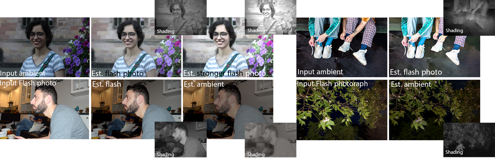

# Computational Flash Photography through Intrinsics


## Setup
TODO
### Environments

###Training
Navigate to [dataset preparation instructions](./dataset_prepare/) to download and prepare the training dataset. 
For decomposition:
```sh
python train.py --dataroot DATASETDIR --name flashDecomposition --model IntrinsicFlashDecomposition  --normalize_flash 1 --normalize_ambient 1 --no_vgg_loss --no_gan_loss  
```
For generation:
```sh
python train.py --dataroot DATASETDIR --name flashGeneration --model IntrinsicFlashGeneration  --normalize_flash 1 --normalize_ambient 1 --no_vgg_loss --no_gan_loss  
```


### Evaluation
TODO

##Citation
This implementation is provided for academic use only. Please cite our paper if you use this code or any of the models.
##Credits
The training skeleton is adaptod from the [pytorch-CycleGAN-and-pix2pix][4] repository.
The network architecture is adopted from the [MiDaS][1] repository.

[1]: https://github.com/intel-isl/MiDaS/tree/v2
[4]: https://github.com/junyanz/pytorch-CycleGAN-and-pix2pix